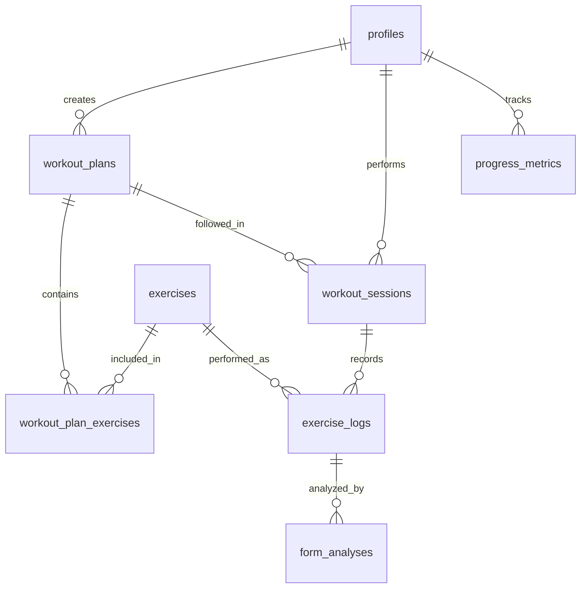

# Supabase Integration Strategy for FormCoach

## 1. Recommended Supabase Services

### Supabase Auth

**Recommendation:** Implement immediately

- Provides built-in authentication with multiple providers (email/password, social logins)
- Supports JWT tokens for secure API access
- Handles password resets and email verification workflows
- Integrates seamlessly with row-level security

### Supabase Database (PostgreSQL)

**Recommendation:** Implement immediately

- Stores all user data, workout plans, exercise records, and progression metrics
- Supports complex queries for analytics and reporting
- Offers real-time subscriptions for live updates
- Provides robust data integrity through relationships and constraints

### Supabase Storage

**Recommendation:** Implement immediately

- Stores user-uploaded workout videos for form analysis
- Manages profile pictures and other media assets
- Supports access control policies aligned with database permissions
- Offers CDN capabilities for fast content delivery

### Supabase Edge Functions

**Recommendation:** Implement selectively

- Handles complex server-side logic like AI processing coordination
- Manages third-party API integrations
- Processes webhooks and scheduled tasks
- Implements business logic that requires secure execution

### Supabase Realtime

**Recommendation:** Implement for specific features

- Enables live updates for workout tracking
- Supports collaborative features (future coach feedback)
- Provides instant notifications for AI analysis completion

## 2. Core Schema Design

```sql
-- Users table (extends Supabase auth.users)
CREATE TABLE profiles
(
    id            UUID REFERENCES auth.users PRIMARY KEY,
    username      TEXT UNIQUE,
    full_name     TEXT,
    avatar_url    TEXT,
    height        NUMERIC,
    weight        NUMERIC,
    fitness_level TEXT,
    goals         TEXT[],
    created_at    TIMESTAMP WITH TIME ZONE DEFAULT NOW(),
    updated_at    TIMESTAMP WITH TIME ZONE DEFAULT NOW()
);

-- Exercise library
CREATE TABLE exercises
(
    id                      UUID PRIMARY KEY         DEFAULT uuid_generate_v4(),
    name                    TEXT NOT NULL,
    description             TEXT,
    muscle_groups           TEXT[],
    equipment               TEXT[],
    difficulty_level        TEXT,
    demonstration_video_url TEXT,
    created_at              TIMESTAMP WITH TIME ZONE DEFAULT NOW()
);

-- Workout plans
CREATE TABLE workout_plans
(
    id             UUID PRIMARY KEY         DEFAULT uuid_generate_v4(),
    user_id        UUID REFERENCES profiles (id) ON DELETE CASCADE,
    name           TEXT NOT NULL,
    description    TEXT,
    frequency      TEXT,
    duration_weeks INTEGER,
    is_active      BOOLEAN                  DEFAULT true,
    created_at     TIMESTAMP WITH TIME ZONE DEFAULT NOW(),
    updated_at     TIMESTAMP WITH TIME ZONE DEFAULT NOW()
);

-- Workout plan exercises
CREATE TABLE workout_plan_exercises
(
    id              UUID PRIMARY KEY         DEFAULT uuid_generate_v4(),
    workout_plan_id UUID REFERENCES workout_plans (id) ON DELETE CASCADE,
    exercise_id     UUID REFERENCES exercises (id),
    day_of_week     TEXT,
    sets            INTEGER,
    reps            TEXT,
    rest_seconds    INTEGER,
    notes           TEXT,
    order_index     INTEGER,
    created_at      TIMESTAMP WITH TIME ZONE DEFAULT NOW()
);

-- Workout sessions
CREATE TABLE workout_sessions
(
    id              UUID PRIMARY KEY         DEFAULT uuid_generate_v4(),
    user_id         UUID REFERENCES profiles (id) ON DELETE CASCADE,
    workout_plan_id UUID REFERENCES workout_plans (id),
    start_time      TIMESTAMP WITH TIME ZONE DEFAULT NOW(),
    end_time        TIMESTAMP WITH TIME ZONE,
    notes           TEXT,
    overall_feeling TEXT,
    created_at      TIMESTAMP WITH TIME ZONE DEFAULT NOW()
);

-- Exercise logs
CREATE TABLE exercise_logs
(
    id                 UUID PRIMARY KEY         DEFAULT uuid_generate_v4(),
    workout_session_id UUID REFERENCES workout_sessions (id) ON DELETE CASCADE,
    exercise_id        UUID REFERENCES exercises (id),
    sets_completed     INTEGER,
    reps_completed     INTEGER[],
    weights_used       NUMERIC[],
    video_url          TEXT,
    form_feedback      TEXT,
    soreness_rating    INTEGER,
    created_at         TIMESTAMP WITH TIME ZONE DEFAULT NOW()
);

-- AI form analysis
CREATE TABLE form_analyses
(
    id                      UUID PRIMARY KEY         DEFAULT uuid_generate_v4(),
    exercise_log_id         UUID REFERENCES exercise_logs (id) ON DELETE CASCADE,
    video_url               TEXT,
    analysis_status         TEXT                     DEFAULT 'pending',
    form_score              NUMERIC,
    feedback                TEXT,
    detected_issues         TEXT[],
    improvement_suggestions TEXT[],
    joint_angles            JSON,
    created_at              TIMESTAMP WITH TIME ZONE DEFAULT NOW(),
    updated_at              TIMESTAMP WITH TIME ZONE DEFAULT NOW()
);

-- User progress metrics
CREATE TABLE progress_metrics
(
    id            UUID PRIMARY KEY         DEFAULT uuid_generate_v4(),
    user_id       UUID REFERENCES profiles (id) ON DELETE CASCADE,
    metric_type   TEXT,
    metric_value  NUMERIC,
    recorded_date DATE                     DEFAULT CURRENT_DATE,
    notes         TEXT,
    created_at    TIMESTAMP WITH TIME ZONE DEFAULT NOW()
);
```

### Entity Relationship Diagram



## 3. Authentication and Row-Level Security

### Authentication Setup

- Implement email/password authentication for MVP
- Add social login options (Google, Apple) for convenience
- Set up email verification workflows
- Configure password reset functionality
- Store additional user data in the profiles table

### Row-Level Security Policies

```sql
-- Profiles table RLS
ALTER TABLE profiles ENABLE ROW LEVEL SECURITY;

CREATE
POLICY "Users can view their own profile"
  ON profiles FOR
SELECT
    USING (auth.uid() = id);

CREATE
POLICY "Users can update their own profile"
  ON profiles FOR
UPDATE
    USING (auth.uid() = id);

-- Workout plans RLS
ALTER TABLE workout_plans ENABLE ROW LEVEL SECURITY;

CREATE
POLICY "Users can view their own workout plans"
  ON workout_plans FOR
SELECT
    USING (auth.uid() = user_id);

CREATE
POLICY "Users can create their own workout plans"
  ON workout_plans FOR INSERT
  WITH CHECK (auth.uid() = user_id);

CREATE
POLICY "Users can update their own workout plans"
  ON workout_plans FOR
UPDATE
    USING (auth.uid() = user_id);

CREATE
POLICY "Users can delete their own workout plans"
  ON workout_plans FOR DELETE
USING (auth.uid() = user_id);

-- Similar policies for other tables...
```

### Role-Based Access

- Create a `user_roles` table to support future role-based access (coaches, premium users)
- Implement function-based policies for advanced permission scenarios
- Use Supabase's JWT claims for role verification

## 4. MVP vs. Post-MVP Design Decisions

### MVP Implementation

- **Auth:** Email/password authentication
- **Database:** Core tables for users, exercises, workout plans, and logs
- **Storage:** Basic video upload for form analysis
- **Schema:** Implement essential tables with minimal columns
- **Security:** Basic RLS policies for data protection

### Post-MVP Considerations

- **Social Features:** Friend connections, sharing, and social feed
- **Advanced Analytics:** Detailed progress tracking and visualization
- **Coach Integration:** Roles and permissions for trainers/coaches
- **Subscription Tiers:** Premium features and content
- **Notifications:** Push notifications and alerts
- **Offline Support:** Local storage and sync strategies
- **Multi-device Sync:** Real-time data synchronization
- **Localization:** Multi-language support
- **Gamification:** Achievements, streaks, and rewards

## 5. Scaling Considerations and Gotchas

### Database Scaling

- **Large Video Storage:** Plan for significant storage needs with user videos
- **Read-Heavy Workloads:** Implement caching strategies for workout plans and exercise library
- **Write Concurrency:** Design to handle multiple users logging workouts simultaneously
- **Query Optimization:** Create appropriate indexes for common query patterns

### Performance Considerations

- **Video Processing:** Implement client-side compression before upload
- **Pagination:** Implement cursor-based pagination for workout history
- **Subscriptions:** Limit real-time subscriptions to active sessions only
- **Edge Functions:** Monitor cold start times and execution limits

### Potential Gotchas

- **Storage Costs:** Video storage can become expensive at scale
- **RLS Overhead:** Complex policies can impact query performance
- **Rate Limits:** Be aware of Supabase service limits
- **Function Timeouts:** Edge functions have execution time limits
- **Data Migration:** Plan for schema evolution as the app grows
- **Backup Strategy:** Implement regular database backups

## 6. AI Feedback Workflow Support

### Video Processing Pipeline

1. **Upload:** Store workout videos in Supabase Storage
2. **Trigger:** Use database triggers or Edge Functions to initiate analysis
3. **Processing:** Send video URL to external AI service or process with Edge Functions
4. **Storage:** Save analysis results in the `form_analyses` table
5. **Notification:** Use Realtime to notify users when analysis is complete

### Implementation Recommendations

- Create a dedicated storage bucket with appropriate access policies
- Implement video chunking for longer workout sessions
- Store reference poses and ideal form examples for comparison
- Use metadata tables to track processing status
- Implement retry logic for failed analyses

### Data Structure for AI Results

- Store structured feedback in JSON format for flexible UI rendering
- Include timestamp markers for specific form issues in videos
- Maintain historical analysis data for progress tracking
- Link analysis results directly to specific exercise logs

## 7. Development and DevOps Strategy

### Local Development

- Use Supabase CLI for local development environment
- Implement database migrations for schema changes
- Create seed data scripts for testing
- Use TypeScript with generated types from Supabase schema

### CI/CD Pipeline

- Automate database migrations in deployment pipeline
- Implement staging environment with data isolation
- Use GitHub Actions for automated testing and deployment
- Create database schema validation tests

### Environment Management

- Use separate Supabase projects for development and production
- Currently, both dev and stage GitHub branches use the same Supabase project (`formcoach-dev`)
- The production branch uses a separate Supabase project (`formcoach`)
- Implement environment-specific configuration
- Create service tokens with appropriate permissions
- Document API and schema changes

> **Note**: When a separate Supabase project for staging is created, this section will be updated to include three
> distinct Supabase projects.

### Monitoring and Maintenance

- Set up logging and monitoring for Edge Functions
- Implement database performance monitoring
- Create alerts for storage usage thresholds
- Schedule regular database maintenance tasks

---

This integration strategy provides a solid foundation for building FormCoach with Supabase, balancing immediate
implementation needs with future scalability considerations. The approach leverages Supabase's strengths in
authentication, data storage, and real-time capabilities while providing a clear path for incorporating AI-powered form
analysis.
